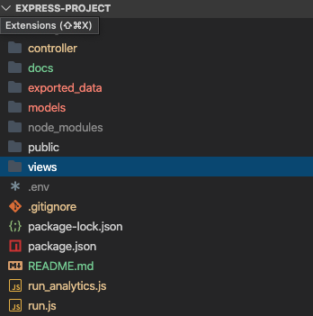

## 

**Business Logic. Data Access and Templates**

**Requirement Code - R1**

**Implements an application layer which interfaces with a database to solve business problems**

There are two prototype applications. These are extension of RideShare app, to provide customer with more preferences to control time and cost of their journeys and to get other businesses to offer RideShare services to customers through their own Apps with a different pricing and revenue sharing model. 

1. All operations of the object like view, export all, sum, average etc. 

```html
---- API to get all riders
http://localhost:3035/riders  
---- API to get single rider by id
http://localhost:3035/riders/:id
---- HTML for to create rider
http://localhost:3035/rider
---- API to get average price of the minimum fare of a taxi ride
http://localhost:3035/products/minimumprice/average
---- API to get max of the minimum fare of a taxi ride
http://localhost:3035/products/minimumprice/max
```

run.js should be run to invoke this application.

2. Business Operations and Support Dashboard

```html
http://localhost:3031/business
```

run_analytics.js should be run to invoke this application.

Before running the two application, the following steps should be followed.

1. Install MySQL and create a user for application with password. Test the connection works with the new user.

2. Create database with data and views using the following scripts. All scripts should be run in order. 

   ```html
   ./models/ScriptsWithCreateDBAndTablesAndData/rideshare_server_RIDERS.sql
   ./models/ScriptsWithCreateDBAndTablesAndData/rideshare_server_RiderPreferences.sql
   ./models/ScriptsWithCreateDBAndTablesAndData/rideshare_server_AppPartners.sql
   ./models/ScriptsWithCreateDBAndTablesAndData/rideshare_server_Products.sql
   ./models/ScriptsWithCreateDBAndTablesAndData/rideshare_server_ProductAppPartners.sql	
   ./models/Create_View_Scripts.sql
   ./models/Create_Views_With_Joins_Scripts.sql
   ```

3. Create a .env file in the home directory of application with following parameters and the correct values.

   ```html
   PORT='3035'
   PORT_ANALYTICS='3031'
   DATABASE='rideshare_server'
   USERNAME='vvvvvv'
   PASSWORD='xxxxxx'
   HOST='localhost'
   ```

4. Install node packages.

5. Run the applications.

**Structure of Files**



**config** - configuration files for different environments (development, staging, testing)

**controller**  - has the routes

**docs**  -  has the images and other files

**exported_data** - exported data from database

**model** - all database and ORM components inclusing sql, modal generator and seed data generator

**node_modules** - all node packages used

**public** - resources for web like css and images

**views** - hbs (view engine files with html)

**.env** - environment variables 

**.gitignore** - files that should not be in git repository

**run_analytics.js** - business operations application

**run.js** - customer and partner management application


**Requirement Code - R2**

**Produces a professional report that provides an analysis of privacy and security concerns relating to a system**

Express with Sequelize is a good combination to reduce security risks to a system.

1. The main framework I am using is express. Express provides express-validators to validate data before doing anything with the data that is received by server. It is developers responsibility to use it correctly and implement all required validation. Most of the data that is sent and received by API's is parameters in the url and in the body using json. Express provides middleware like urlencoders and json processers to avoid any misuse of apps to extract private data of customers in database. It is also developers responsibility to use them to secure private data. These modules are used in the controller and can be found in <a href="./controller/server.js">code</a>. It is important to use these package to sanitise user input. 

2. I have used sequelize ORM for all database interactions(<a href="./models/models.js">Model Code</a>). All the entities can be found in the ./modals directory. ORM's are very efficient in strictly validating the input to field validation defined in the entity definition. Any deviation from the definition of the fields and entities result in the rejection of data with an error. It is very helpful to prevent attacks like SQL injection if used properly. The database tables have to be designed well and the developer should develop the modal with all necessary field constraints. 
3. Use a .env file with usernames and any required tokens for database and this file should not be added to GitHub. Additional config file like ./config/config.js can be used to separate environments.
4. Seed data should be used in development instead of real customer data even if it is de-identified. This <a href="./models/seed.js">Code</a> can be used to generate seed data. A random data generator can be added to code.

Some large applications may prefer not to use ORM's as it is slightly slower than raw queries. In that case a developer should write or use a package to validate input data. 


**Requirement Code - R3**

**Produces a professional report which discusses professional, ethical and legal obligations relating to a system**

Obligations as a Developer

**Professional**

Projects have to be delivered on time, but it doesn't mean to take shortcuts to meat the time deadlines. Shortcuts would be delivering a bad product that will a nighmare for ongoing operations and maintenance. 

If there are any risks a developer notices, that delay the delivery of the project, it should be immediately escalated to project manager and added to risk register. 

If there are tasks that are taking longer than the allocated time, then a developer should not be working round the clock to complete it, instead of reporting it, because overworked developers can develop a code that have a lot more defects and it would affect the testing and releases. 

It is very important for a developer to look for both, requirement and technical issues, that may delay the project early and get them resolved. Otherwise it affects all the stages of the project. 

**Ethical**

There are industry practices that help being ethical with software development. But it is not just that. If something is legally ok, doesn't mean it is ethically ok. Software and data are so powerful that it can cause adverse effects. Especially in case of apps on small devices, it is not carefully thought through and can be bad. It is always better for a developer to think about the ethical issues associated with software and discuss with a team member or team or someone senior for guidance. 

**Legal**