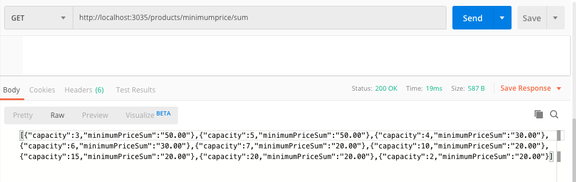

## 

**Business Logic. Data Access and Templates**

**Requirement Code - R1**

**Implements an application layer which interfaces with a database to solve business problems**

There are two prototype applications. These are extension of RideShare app, to provide customer with more preferences to control time and cost of their journeys and to get other businesses to offer RideShare services to customers through their own Apps with a different pricing and revenue sharing model. 

1. All operations of the object like view, export all, sum, average etc. 

```html
---- API to get all riders
http://localhost:3035/riders  
---- API to get single rider by id
http://localhost:3035/riders/:id
---- HTML for to create rider
http://localhost:3035/rider
---- API to get average price of the minimum fare of a taxi ride
http://localhost:3035/products/minimumprice/average
---- API to get max of the minimum fare of a taxi ride
http://localhost:3035/products/minimumprice/max
```

run.js should be run to invoke this application.

2. Business Operations and Support Dashboard

```html
http://localhost:3031/business
```

run_analytics.js should be run to invoke this application.

Before running the two application, the following steps should be followed.

1. Install MySQL and create a user for application with password. Test the connection works with the new user.

2. Create database with data and views using the following scripts. All scripts should be run in order. 

   ```html
   ./models/ScriptsWithCreateDBAndTablesAndData/rideshare_server_RIDERS.sql
   ./models/ScriptsWithCreateDBAndTablesAndData/rideshare_server_RiderPreferences.sql
   ./models/ScriptsWithCreateDBAndTablesAndData/rideshare_server_AppPartners.sql
   ./models/ScriptsWithCreateDBAndTablesAndData/rideshare_server_Products.sql
   ./models/ScriptsWithCreateDBAndTablesAndData/rideshare_server_ProductAppPartners.sql	
   ./models/Create_View_Scripts.sql
   ./models/Create_Views_With_Joins_Scripts.sql
   ```

3. Create a .env file in the home directory of application with following parameters and the correct values.

   ```html
   PORT='3035'
   PORT_ANALYTICS='3031'
   DATABASE='rideshare_server'
   USERNAME='vvvvvv'
   PASSWORD='xxxxxx'
   HOST='localhost'
   ```

4. Install node packages.

5. Run the applications.

**Structure of Files**


**config** - configuration files for different environments (development, staging, testing)

**controller**  - has the routes

**docs**  -  has the images and other files

**exported_data** - exported data from database

**model** - all database and ORM components inclusing sql, modal generator and seed data generator

**node_modules** - all node packages used

**public** - resources for web like css and images

**views** - hbs (view engine files with html)

**.env** - environment variables 

**.gitignore** - files that should not be in git repository

**run_analytics.js** - business operations application

**run.js** - customer and partner management application


**Requirement Code - R2**

**Produces a professional report that provides an analysis of privacy and security concerns relating to a system**

Express with Sequelize is a good combination to reduce security risks to a system.

1. The main framework I am using is express. Express provides express-validators to validate data before doing anything with the data that is received by server. It is developers responsibility to use it correctly and implement all required validation. Most of the data that is sent and received by API's is parameters in the url and in the body using json. Express provides middleware like urlencoders and json processers to avoid any misuse of apps to extract private data of customers in database. It is also developers responsibility to use them to secure private data. These modules are used in the controller and can be found in <a href="./controller/server.js">code</a>. It is important to use these package to sanitise user input. 

2. I have used sequelize ORM for all database interactions(<a href="./models/models.js">Model Code</a>). All the entities can be found in the ./modals directory. ORM's are very efficient in strictly validating the input to field validation defined in the entity definition. Any deviation from the definition of the fields and entities result in the rejection of data with an error. It is very helpful to prevent attacks like SQL injection if used properly. The database tables have to be designed well and the developer should develop the modal with all necessary field constraints. 
3. Use a .env file with usernames and any required tokens for database and this file should not be added to GitHub. Additional config file like ./config/config.js can be used to separate environments.
4. Seed data should be used in development instead of real customer data even if it is de-identified. This <a href="./models/seed.js">Code</a> can be used to generate seed data. A random data generator can be added to code.

Some large applications may prefer not to use ORM's as it is slightly slower than raw queries. In that case a developer should write or use a package to validate input data. 


**Requirement Code - R3**

**Produces a professional report which discusses professional, ethical and legal obligations relating to a system**

Obligations as a Developer

**Professional**

Projects have to be delivered on time, but it doesn't mean to take shortcuts to meat the time deadlines. Shortcuts would be delivering a bad product that will a nighmare for ongoing operations and maintenance. 

If there are any risks a developer notices, that delay the delivery of the project, it should be immediately escalated to project manager and added to risk register. 

If there are tasks that are taking longer than the allocated time, then a developer should not be working round the clock to complete it, instead of reporting it, because overworked developers can develop a code that have a lot more defects and it would affect the testing and releases. 

It is very important for a developer to look for both, requirement and technical issues, that may delay the project early and get them resolved. Otherwise it affects all the stages of the project. 

**Ethical**

There are industry practices that help being ethical with software development. But it is not just that. If something is legally ok, doesn't mean it is ethically ok. Software and data are so powerful that it can cause adverse effects. Especially in case of apps on small devices, it is not carefully thought through and can be bad. It is always better for a developer to think about the ethical issues associated with software and discuss with a team member or team or someone senior for guidance. 

**Legal**

\- legal obligations: that you have assessed whether the application is subject to any legal regulation, if none, consider any privacy implications


**Requirement Code - R4**

**Uses programming language features or frameworks to implement a data model**

The server side application developed in NodeJS is to extend functionality provided by the existing RideShare application. 

The data model used can be found in ./models directory. Sequelize, a popular ORM tool is used to manage queries to write and read from the database.

There are two main data validation implemented.

1. Using the constraints in the data model to validate data before sending to database.

   ```javascript
   
   module.exports = function(sequelize, DataTypes) {
   	return sequelize.define('RiderPreferences', {
   		'riderId': {
   			type: DataTypes.INTEGER,
   			allowNull: false,
   			primaryKey: true,
   			comment: "null",
   			references: {
   				model: 'Riders',
   				key: 'riderId'
   			}
   		},
   		'tollRoadPreferred': {
   			type: DataTypes.INTEGER(1),
   			allowNull: false,
   			defaultValue: '0',
   			comment: "null"
   		},
   		'shortDurationPreferred': {
   			type: DataTypes.INTEGER(1),
   			allowNull: false,
   			defaultValue: '0',
   			comment: "null"
   		},
   ```

2. Using express-validator to validate form data.

   ```javascript
   const { check, validationResult } = require('express-validator');
   
   app.post('/rider', [
       // email must be valid
       check('email').isEmail(),
       // lastname must be at least 5 chars long
       check('lastname').isLength({ min: 5 })
   ], async (req, res) => {
   ```

   

**Requirement Code - R5**

**Uses programming language features or frameworks to manipulate a data model**

The controller with routes can be found in <a href="./controller/server.js">Code</a>.

**CREATE**

​	New Form - The new form is posted to /rider api. 


​	POST /rider

​	If the creation is successful, the following json object is returned.


**READ**

​	GET /riders/:id


**UPDATE**

​	PUT /riders/:id


**DELETE**

​	DELETE /riders/:id   (Cascade delete is set to delete all related records from child table. The script is included in <a href="./models/Create_tables_rideshare.sql">following file</a>.)


**EXPORT ALL DATA**

GET /riders


**Requirement Code - R6**

**Uses programming language features or frameworks to display data**

Express with sequelize connecting to database is used to display data in tabular form. 

The controller with routes can be found in <a href="./controller/analytics_server.js">Code</a>. 


**Requirement Code - R7**

**Implements application layer which utilises a database to produce aggregated data relating to business matters**

The API routes are in <a href="./controller/server.js">Code</a>. The screen shots were generated using Postman. Sequalize queries were used to extract min, max, sum and average from database. 

/products/minimumprice/sum



/products/minimumprice/average


/products/minimumprice/min


/products/minimumprice/max


Requirement Code - R8**

**Implements input validation and integrity checks on data to address business risks**

1. Used validation package 'express-validator' to validate fields before posting it to database. 

```javascript
const { check, validationResult } = require('express-validator');

app.post('/rider', [
    // email must be valid
    check('email').isEmail(),
    // lastname must be at least 5 chars long
    check('lastname').isLength({ min: 5 })
], async (req, res) => {
```

​	It helps to validate form data before trying to write into database. Length validation can help avoid null or less than 	minumum required length.


​	Submitting an empty form to the API will result in error.


​		Incorrect email formats will result in an error.


2. Used limiting selectable fields where possible to avoid entry of random data. This will also check the relationship constraints before trying to write it into database.


3. Next level of validation is in the database model developed using sequelize that validates datatypes constraints. The models are defined in folder "./models".

If a non integer value is entered into a integer field, it will result in error.


4. Used npm packages with zero vulnerabilities and also used express middleware express.json and express.urlencoded()
5. Database triggers were not used, but it can be used to do further validation before insertion of data into database.

The above mentioned tests were executed, but in a commercial application detailed application and security tests are required. 


**Database Scripting and Queries**

**Requirement Code - R9**

**Analyses a problem scenario and creates database tables and fields**

<a href="./models/Create_tables_rideshare.sql">Scripts to create tables and fields.</a>

```mysql
--- Create table scripts

CREATE TABLE IF NOT EXISTS Riders (
    riderId INT AUTO_INCREMENT PRIMARY KEY,
    firstname VARCHAR(255) NOT NULL,
    lastname VARCHAR(255) NOT NULL,
    email VARCHAR(255) NOT NULL,
    mobile VARCHAR(255) NOT NULL,
    createdAt TIMESTAMP DEFAULT CURRENT_TIMESTAMP,
    updatedAt TIMESTAMP DEFAULT CURRENT_TIMESTAMP
)  ENGINE=INNODB;

ALTER TABLE RIDERS ADD COLUMN score INTEGER;

CREATE TABLE IF NOT EXISTS RiderPreferences (
    riderId INT PRIMARY KEY,
    tollRoadPreferred BOOL NOT NULL DEFAULT 0,
    shortDurationPreferred BOOL NOT NULL DEFAULT 0,
    createdAt TIMESTAMP DEFAULT CURRENT_TIMESTAMP,
    updatedAt TIMESTAMP DEFAULT CURRENT_TIMESTAMP,
    FOREIGN KEY (riderId) REFERENCES Riders(riderId)
)  ENGINE=INNODB;

-- if the constraint has to be dropped, name the constraint
ALTER TABLE RiderPreferences DROP CONSTRAINT riderpreferences_ibfk_1;

-- DELETE CASCADE will delete the child records if the parent record is deleted.
ALTER TABLE RiderPreferences 
ADD CONSTRAINT riderpreferences_ibfk_1 FOREIGN KEY (riderId)
        REFERENCES Riders(riderId)
        ON DELETE CASCADE;

CREATE TABLE IF NOT EXISTS AppPartners (
	appPartnerId INT AUTO_INCREMENT PRIMARY KEY,
    appPartnerName VARCHAR(255) NOT NULL,
    isGlobalAppPartner BOOL NOT NULL DEFAULT 0,
    revenueSharing BOOL NOT NULL DEFAULT 0,
    revenueSharePercentage INT DEFAULT 0,
    createdAt TIMESTAMP DEFAULT CURRENT_TIMESTAMP,
    updatedAt TIMESTAMP DEFAULT CURRENT_TIMESTAMP,
    CHECK (revenueSharePercentage <= 50)
)  ENGINE=INNODB;

CREATE TABLE IF NOT EXISTS Products (
	productId INT AUTO_INCREMENT PRIMARY KEY,
    productName VARCHAR(255) NOT NULL UNIQUE,
    capacity INT NOT NULL,
    basePrice DECIMAL(10, 2) NOT NULL,
    minimumPrice DECIMAL(10, 2) NOT NULL,
    costPerMinute DECIMAL(10, 2) NOT NULL,
    costPerDistance DECIMAL(10, 2) NOT NULL,
    serviceFees DECIMAL(10, 2) NOT NULL,
    createdAt TIMESTAMP DEFAULT CURRENT_TIMESTAMP,
    updatedAt TIMESTAMP DEFAULT CURRENT_TIMESTAMP
)  ENGINE=INNODB;

CREATE TABLE IF NOT EXISTS ProductAppPartners (
	productId INT,
    appPartnerId INT,
    createdAt TIMESTAMP DEFAULT CURRENT_TIMESTAMP,
    updatedAt TIMESTAMP DEFAULT CURRENT_TIMESTAMP,
    PRIMARY KEY (productId, appPartnerId),
    FOREIGN KEY (productId) REFERENCES Products(productId),
    FOREIGN KEY (appPartnerId) REFERENCES AppPartners(appPartnerId)
)  ENGINE=INNODB;

-- End of create table scripts
```


One to One Relationship

The relationship between Riders and RiderPreferences table is one to one where riderId in RiderPreferences has a foreign key relationship with Riders and also riderId is primary key RiderPreferences, so it allows only one unique record linked to Riders. 

One to Many Relationship

The relationship between AppPartners table and ProductAppPartners junction table is one-to-many relationship where primary key of AppPartners is the foreign key of ProductAppPartners. Similarly, the relationship between Products and ProductAppPartners is one-to-many relationship. The junction table ProductAppPartners helps to establish a many-to-many relationship between AppPartners and Products.

**Analyses a problem scenario and creates relationships between tables which enable queries relevant to the scenario**

The scenario is to create two extensions to existing RideShareApp, to provide fares to customers based on the preferences and partner with other businesses to bring in revenue through their customer base. 

Creating a one to one related customers preferences tables is the easiest to collect customer preferences and the queries with left join can progressively get data about customer preferences.

Multiple one to many relationships between Products, AppPartners and ProductAppPartners is the best way to link and make querying easy between Product and AppPartners. The combination of Products and AppPartners is uniques implemented using primary key, which makes the query easy by avoiding additional checks in query. 

**Analyses a problem scenario and implements integrity checks relevant to the scenario**

Based on the requirements of app and business partners primary key and foreign key relationships are setup. This avoids getting unrelated data into the tables. Some of the fields are mandatory for the business to work properly and the customer to have requirements met, they have not null constraints. Product names have to be unique to avoid any confusion and have a unique constraint. Check constraints have been added to limit the values that can be added to a field. 

**Requirement Code - R10**

**Develops complex queries which select, filter, group and order data.**

The scripts were developed and stored as views in MySQL database. View were used to access the query results and display in tabular form. 

<a href="./models/Create_View_Scripts.sql">Scripts file</a>

```mysql
-- identifies anomalies in emails

CREATE VIEW v_incorrect_rider_emails AS
    SELECT email, count(email) number_of_incorrect_email_ids FROM riders 
    WHERE firstname = lastname 
    GROUP BY email
    ORDER BY number_of_incorrect_email_ids DESC;

-- identifies anomalies in customer preferences

CREATE VIEW v_preference_anomaly AS
WITH 
TollRoadPreference AS (SELECT tollRoadPreferred, COUNT(tollRoadPreferred) no_of_toll_road_preference
 FROM RiderPreferences WHERE updatedAt < DATE_SUB(NOW(), INTERVAL 6 HOUR) AND tollRoadPreferred != shortDurationPreferred 
 GROUP BY tollRoadPreferred),
ShortDurationPreference AS (SELECT shortDurationPreferred, COUNT(shortDurationPreferred) no_of_short_duration_preference
 FROM RiderPreferences WHERE updatedAt < DATE_SUB(NOW(), INTERVAL 6 HOUR) AND tollRoadPreferred != shortDurationPreferred
 GROUP BY shortDurationPreferred )
SELECT no_of_toll_road_preference TollRoad, no_of_short_duration_preference ShortDuration, 
CASE
    WHEN shortDurationPreferred = 0 THEN 'Not Preferred'
    ELSE 'Preferred'
END Preference
FROM TollRoadPreference 
INNER JOIN ShortDurationPreference ON tollRoadPreferred = shortDurationPreferred
ORDER BY shortDurationPreferred DESC;

-- identifies high revenue sharing partners
CREATE VIEW v_app_partners_with_max_revenue_sharing AS
SELECT isGlobalAppPartner, COUNT(isGlobalAppPartner) NumberOfPartners, 
GROUP_CONCAT(appPartnerName SEPARATOR ',') ListOfParners,
CASE
    WHEN isGlobalAppPartner = 0 THEN 'Local App Partner'
    ELSE 'Global App Partner'
END PartnerType 
FROM AppPartners  
WHERE revenueSharePercentage = 50
GROUP BY isGlobalAppPartner
ORDER BY isGlobalAppPartner desc;
```

The following route gives the data returned from query.

http://localhost:3031/business

The data can be used in dashboards by Business Operation Support staff to identify issues with data and by Business to get a quick view of the partnerships to make decisions. 


**Requirement Code - R11**

**Develops complex queries which join tables together.**

The join scripts were stored as views in the MySQL database and displayed in tabular form for business operations and support. The left join shows missing preferences. 

<a href="./models/Create_Views_With_Joins_Scripts.sql">Scripts with Joins</a>

```mysql
-- get rider with preferences

CREATE VIEW v_riders_with_preferences AS 
SELECT Riders.riderId, Riders.firstname, Riders.lastname, Riders.email, 
Riders.mobile, RiderPreferences.tollRoadPreferred, 
RiderPreferences.shortDurationPreferred 
FROM Riders
LEFT JOIN RiderPreferences 
ON Riders.riderId = RiderPreferences.riderId;

-- get app partner and products with details

CREATE VIEW v_app_partner_and_products AS
SELECT ProductAppPartners.appPartnerId, AppPartners.appPartnerName,
ProductAppPartners.productId,  Products.productName
FROM ProductAppPartners
INNER JOIN AppPartners ON AppPartners.appPartnerId = ProductAppPartners.appPartnerId
INNER JOIN Products ON Products.productId = ProductAppPartners.productId;


```

The following route gives the data returned from query.

http://localhost:3031/business

The queries help business operations to get overview of data or it can be used in other pages and apis.


**Requirement Code - R12**

**Implements a script to export all data from the database.**

The scipts below can export data from tables as csv and store it in a file. It can be used to load into another database.

<a href="./exported_data/export_all_data.sql">Export Data Script</a>

```mysql
SELECT 
    'riderId', 'firstname', 'lastname', 'email', 'mobile', 'createdAt', 'updatedAt'
UNION ALL 
SELECT 
    riderId, firstname, lastname, email, mobile, createdAt, updatedAt
FROM
    Riders
INTO OUTFILE '/tmp/exported_data/Riders.csv' 
FIELDS ENCLOSED BY '"' 
TERMINATED BY ',' 
ESCAPED BY '"' 
LINES TERMINATED BY '\r\n';


SELECT 'riderId','tollRoadPreferred','shortDurationPreferred','createdAt','updatedAt'
UNION ALL
SELECT riderId, tollRoadPreferred, shortDurationPreferred, createdAt, updatedAt 
FROM RiderPreferences 
INTO OUTFILE '/tmp/exported_data/RiderPreferences.csv' 
FIELDS ENCLOSED BY '"' 
TERMINATED BY ',' 
ESCAPED BY '"' 
LINES TERMINATED BY '\r\n';


SELECT 'productId','productName','capacity','basePrice','minimumPrice', 
'costPerMinute','costPerDistance','serviceFees','createdAt','updatedAt'
UNION ALL
SELECT productId, productName, capacity, basePrice, minimumPrice, 
costPerMinute, costPerDistance, serviceFees, createdAt, updatedAt
FROM Products
INTO OUTFILE '/tmp/exported_data/Products.csv' 
FIELDS ENCLOSED BY '"' 
TERMINATED BY ',' 
ESCAPED BY '"' 
LINES TERMINATED BY '\r\n';

SELECT 'appPartnerId','appPartnerName','isGlobalAppPartner','revenueSharing',
'revenueSharePercentage','createdAt','updatedAt'
UNION ALL
SELECT appPartnerId, appPartnerName, isGlobalAppPartner, revenueSharing,
revenueSharePercentage, createdAt, updatedAt
FROM AppPartners
INTO OUTFILE '/tmp/exported_data/AppPartners.csv' 
FIELDS ENCLOSED BY '"' 
TERMINATED BY ',' 
ESCAPED BY '"' 
LINES TERMINATED BY '\r\n';

SELECT 'productId','appPartnerId','createdAt','updatedAt'
UNION ALL 
SELECT productId, appPartnerId, createdAt, updatedAt 
FROM ProductAppPartners
INTO OUTFILE '/tmp/exported_data/ProductAppPartners.csv' 
FIELDS ENCLOSED BY '"' 
TERMINATED BY ',' 
ESCAPED BY '"' 
LINES TERMINATED BY '\r\n';
```

Exported csv data can be found in the following folder.

./exported_data/

